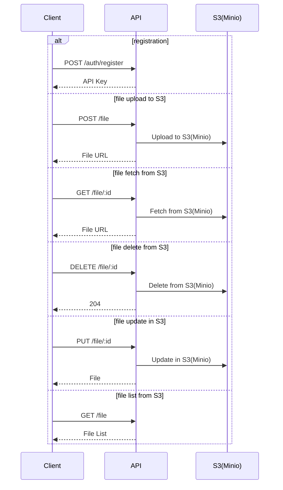

# File Upload Service

## Overview of the assignment
Your task is to build a RESTful API for uploading and managing cat pictures.

### Requirements
Your API MUST support the following operations:
- [x] Upload a cat pic.
- [x] Delete a cat pic.
- [x] Update a previously uploaded cat pic (not just metadata) in place.
- [x] Fetch a particular cat image file by its ID.
- [x] Fetch a list of the uploaded cat pics.


Additionally, you MUST:
- [x] Correctly use HTTP response codes, including error handling.
- [x] Provide documentation for your API's behavior.
- [x] Provide instructions for us to get your API up and running.
- [x] Write a basic suite of tests for your code.

### Suggestions
If you want to show off a little bit, do one or more of the following:
- [x] Dockerize your application, it's okay if your pictures aren't persisted outside of the
container runtime.
- [x] Setup authentication/authorization


## How to run the application

This is a generic file upload service which can be used to upload any type of file. It's not limited to just cat pictures. We can categorize the files by using tags.

### Prerequisites
1. Docker
2. Docker Compose

If you want to tinker with the application, you will also need:
1. Node 18.x.x
2. pnpm 8.x.x

### Running the application

#### Using Docker Compose
```sh
docker compose --env-file docker.env up -d --build
```
The application will start running on port 3000.
```
http://localhost:3000
```

## Design Decisions

### Why Node.js?
I chose Node.js because I've been using it the most since the past 1.5 years so I can implement things quickly.

### Why Nest.js?
It has boilerplate code (typescript, linting, DI) which is already written for you. It also has a lot of plugins which you can use to implement things quickly.

### Why Prisma && Postgres?
- I chose Prisma because it's an ORM which has a very intuitive and fluent interface for quering the database.
- Postgres will be perfect for this application because it does involve a couple of relations

### Why API Key instead of JWT?
- It's faster to implement
- Can easily modify this to use JWT in the future

## Environment Variables
```
DEFAULT_PROVIDER=S3 or LOCAL-FS
```

This is the environment variable you'll most likely want to change. It determines where the files will be stored.

If you select **S3** as the provider, you'll need to do few more things

login to http://localhost:9000 with the credentials
```
username: root
password: password
```
- Create a bucket, with the same name as that of the tag that you will send in the file upload request.
(This can be automated as well, but I didn't have enough time to do it)
- set the bucket as public


## Build Process
- Docker compose will pull, `minio` and `postgres` images
- It will then build the `migration` image which will run the database migration scripts and setup the database
  - This is a short-lived container and it will then be exited
- It will then build the `api` image which will run the application

## API flows at a high level




## Improvements
- [ ] Add more tests
- [ ] Add support for signed-url generation where the file is uploaded directly to S3 by the client, will be useful for large files
- [ ] JWT Authentication
- [ ] Configuration for file validation (size, limit, extensions, etc.)